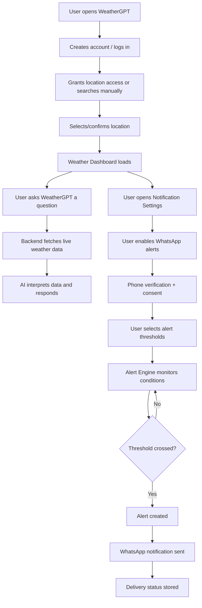
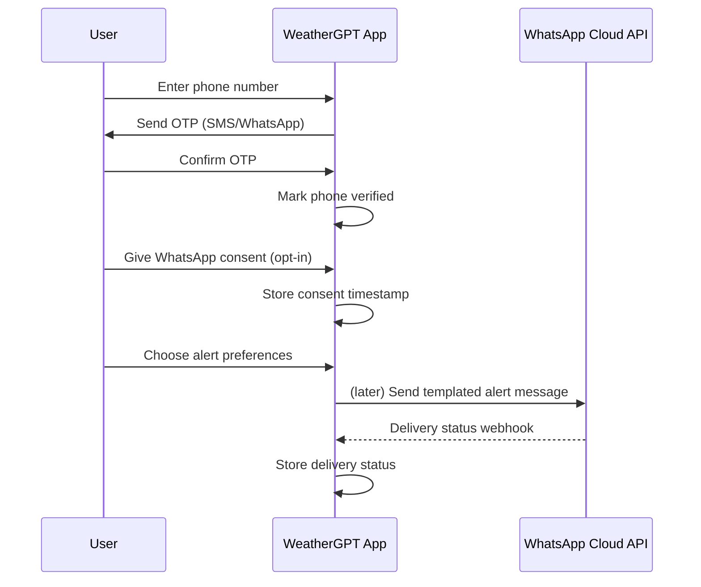
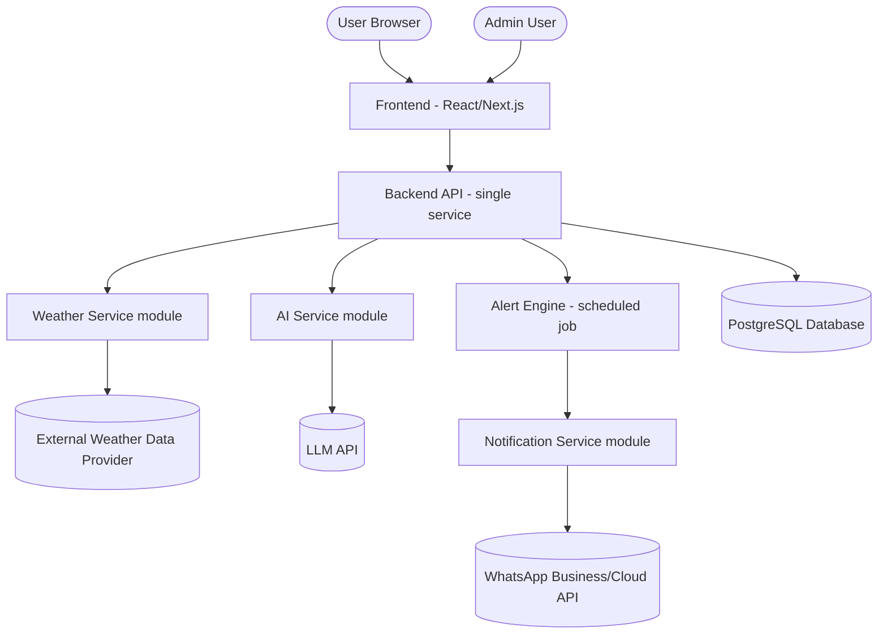

# WeatherGPT

> AI-Powered Weather Forecasting, Alerts & Climate Intelligence Platform

**Document type:** Product Requirements Document (PRD)
**Status:** Draft v1.0
**Audience:** Beginner-level B.Tech CSE/AI-ML student team, hackathon/SIH evaluators
**Author role assumed:** Senior Product Manager / Software Architect / AI-ML Engineer / SIH Mentor

---

## Table of Contents

1. [Product Overview](#1-product-overview)
2. [Problem Statement](#2-problem-statement)
3. [Vision & Goals](#3-vision--goals)
4. [Target Users](#4-target-users)
5. [User Personas](#5-user-personas)
6. [Core Features](#6-core-features)
7. [Functional Requirements](#7-functional-requirements)
8. [AI/ML Requirements](#8-aiml-requirements)
9. [Weather Data Requirements](#9-weather-data-requirements)
10. [WhatsApp Notification Requirements](#10-whatsapp-notification-requirements)
11. [Alert Engine](#11-alert-engine)
12. [Climate Intelligence](#12-climate-intelligence)
13. [User Flows](#13-user-flows)
14. [System Architecture](#14-system-architecture)
15. [Technology Stack](#15-technology-stack)
16. [Database Design](#16-database-design)
17. [API Specification](#17-api-specification)
18. [UI/UX Requirements](#18-uiux-requirements)
19. [Security](#19-security)
20. [Privacy](#20-privacy)
21. [Error Handling](#21-error-handling)
22. [Non-Functional Requirements](#22-non-functional-requirements)
23. [MVP Scope](#23-mvp-scope)
24. [V1 Scope](#24-v1-scope)
25. [Advanced Scope](#25-advanced-scope)
26. [Development Roadmap](#26-development-roadmap)
27. [Testing Strategy](#27-testing-strategy)
28. [Monitoring & Logging](#28-monitoring--logging)
29. [Cost Estimation](#29-cost-estimation)
30. [Hackathon/SIH Differentiation](#30-hackathonsih-differentiation)
31. [Demo Scenario](#31-demo-scenario)
32. [Success Metrics](#32-success-metrics)
33. [Risks & Mitigation](#33-risks--mitigation)
34. [Future Scope](#34-future-scope)
35. [Definition of Done](#35-definition-of-done)

---

## 1. Product Overview

WeatherGPT is a web application that turns raw weather data into **simple, personalized, and actionable information**. Instead of just showing numbers on a dashboard, WeatherGPT explains what those numbers *mean* for the user, answers weather questions in plain language through a conversational AI assistant, and proactively sends alerts — including directly to WhatsApp — when weather conditions the user cares about are expected.

At its core, WeatherGPT is **not a weather-prediction engine**. It does not try to out-forecast meteorological agencies. Instead, it is an **intelligence and communication layer** on top of trusted weather data providers: it fetches accurate weather data, interprets it using an LLM, monitors it for user-defined thresholds, and delivers it through the channel the user is most likely to see (in-app, and WhatsApp).

This distinction matters a lot for a beginner team: **the hard meteorology is outsourced to an API; the product's value is in interpretation, personalization, and delivery.**

---

## 2. Problem Statement

Most weather apps share the same problems:

| Problem | Description |
|---|---|
| Data overload | Apps show many numbers (humidity, UV index, pressure) without explaining what to actually do about them. |
| Generic alerts | Alerts are broadcast to everyone in a region, not tailored to what an individual user cares about. |
| Passive delivery | Users must open the app to check the weather; they are not proactively warned through channels they already use daily (like WhatsApp). |
| No conversational access | Users cannot simply "ask" a natural question like *"should I carry an umbrella today?"* and get a direct answer. |
| Weather vs climate confusion | Most apps blur short-term forecasts and long-term climate trends together, confusing users. |

WeatherGPT addresses these gaps by combining **trusted weather data + LLM-based interpretation + personalized, proactive delivery**.

---

## 3. Vision & Goals

**Vision:** Make weather information as easy to understand as asking a knowledgeable friend, and as easy to receive as a WhatsApp message.

**Goals for the MVP:**

- G1: Show accurate current weather + forecast for any searched location.
- G2: Let users ask natural-language weather questions and get grounded (non-hallucinated) answers.
- G3: Let users subscribe to threshold-based alerts (e.g., rain > 70%).
- G4: Deliver alerts via WhatsApp using an official Business/Cloud API.
- G5: Present the whole system in a way that is technically honest, professional, and demo-ready for a hackathon/SIH audience.

**Non-goals (explicitly out of scope for MVP):**

- Building a custom meteorological forecasting model from scratch.
- Supporting every weather event type globally.
- Building a mobile native app (web-first, responsive).

---

## 4. Target Users

- **Students** who want a quick, simple "should I carry an umbrella" answer.
- **Daily commuters** who want proactive alerts before leaving home.
- **Farmers/small business owners** (illustrative future persona) who care about rain/heat thresholds affecting their work.
- **Hackathon judges / evaluators** — an important secondary "user" whose experience of the demo matters for project success.

---

## 5. User Personas

### Persona 1 — "Riya, the Commuting Student"
- 20 years old, college student in Kolkata.
- Wants to know before leaving home if she needs an umbrella or should leave early due to rain.
- Prefers WhatsApp over opening yet another app.

### Persona 2 — "Arjun, the Small Business Owner"
- Runs a small outdoor food stall.
- Cares about extreme heat and heavy rain because they affect his daily footfall.
- Wants a daily morning briefing message.

### Persona 3 — "Admin/Operator"
- A team member (or the developer during the hackathon demo) who monitors system health, notification delivery, and user activity through the admin dashboard.

---

## 6. Core Features

| # | Module | Summary |
|---|---|---|
| 1 | Weather Dashboard | Current conditions for a searched/saved location |
| 2 | Weather Forecasting | Hourly, 7-day, and (where available) medium-range forecast |
| 3 | WeatherGPT AI Assistant | Conversational Q&A grounded in real weather data |
| 4 | Smart Weather Alerts | Threshold-based alerts with severity levels |
| 5 | WhatsApp Notification System | Delivery of alerts/briefings via official WhatsApp Business API |
| 6 | Personalized Notifications | User-configurable thresholds and schedules |
| 7 | Climate Information | Historical averages and long-term trend context |
| 8 | Location Management | Save, search, rename, default multiple locations |
| 9 | Weather Risk/Impact Intelligence | Converts raw data into practical advice |
| 10 | Admin Dashboard | Manage users, alerts, logs, system health |

---

## 7. Functional Requirements

Each core feature translates into functional requirements (FR). Requirement IDs are referenced later in Testing and Roadmap sections.

### 7.1 Weather Dashboard
- **FR-1.1**: User can search a city/location by name.
- **FR-1.2**: System displays temperature, feels-like, humidity, wind speed/direction, pressure, visibility, UV index, cloud coverage, sunrise/sunset, condition text/icon, rain probability, precipitation.
- **FR-1.3**: If air quality data is available from the configured provider, display AQI; otherwise, hide the field gracefully (do not show fake data).
- **FR-1.4**: Dashboard auto-loads the user's default/last-used location on login.

### 7.2 Weather Forecasting
- **FR-2.1**: Show hourly forecast for the next 24–48 hours (subject to API support).
- **FR-2.2**: Show daily forecast for ~7 days.
- **FR-2.3**: If the configured API supports medium-range (8–14 day) data, display it in a clearly separate section labelled "Extended Outlook — lower confidence."
- **FR-2.4**: Every forecast value must be visually or textually tagged with its source: **"API Forecast"** vs **"AI Interpretation."**

### 7.3 WeatherGPT AI Assistant
- **FR-3.1**: User can type a natural-language weather question.
- **FR-3.2**: System retrieves current/forecast data for the user's active location and passes it as context to the LLM.
- **FR-3.3**: AI responses must be grounded only in supplied data; the assistant must refuse or hedge when data is missing rather than inventing values.
- **FR-3.4**: Conversation history is stored per user for session continuity (MVP: last N messages).

### 7.4 Smart Weather Alerts
- **FR-4.1**: System evaluates fetched weather/forecast data against defined thresholds on a scheduled interval.
- **FR-4.2**: Alerts are categorized as INFO, WARNING, or CRITICAL.
- **FR-4.3**: Duplicate alerts for the same event/location/time-window are suppressed.
- **FR-4.4**: Alerts expire automatically after their relevant time window passes.

### 7.5 WhatsApp Notification System
- **FR-5.1**: User can register and verify a phone number.
- **FR-5.2**: User must explicitly opt in before receiving WhatsApp messages (consent required by WhatsApp policy and by good privacy practice).
- **FR-5.3**: Messages use pre-approved WhatsApp message templates (required for business-initiated messages outside a 24-hour customer service window, per WhatsApp Business Platform policy).
- **FR-5.4**: Delivery status (sent/delivered/read/failed) is recorded per message.
- **FR-5.5**: User can unsubscribe at any time; system honors this immediately for future sends.

### 7.6 Personalized Notifications
- **FR-6.1**: User can set rain-probability threshold, temperature thresholds, preferred briefing time, and which event types they want alerts for.
- **FR-6.2**: Preferences apply per saved location.

### 7.7 Climate Information
- **FR-7.1**: Show historical monthly averages (temperature, rainfall) for a location where a climate data source is configured.
- **FR-7.2**: Clearly labelled as "Climate Averages" separate from "Forecast."

### 7.8 Location Management
- **FR-8.1**: Detect current location (with permission) or search manually.
- **FR-8.2**: Save multiple named locations; set one as default; rename/remove.

### 7.9 Weather Risk/Impact Intelligence
- **FR-9.1**: Generate short, plain-language practical advice from current/forecast data (e.g., "carry an umbrella").
- **FR-9.2**: All such advice is labelled "general informational guidance — not professional/emergency advice."

### 7.10 Admin Dashboard
- **FR-10.1**: Admin can view/search registered users, saved locations, alert rules, notification logs, WhatsApp delivery status, and basic system health (API up/down, error counts).

---

## 8. AI/ML Requirements

### 8.1 Where AI/ML genuinely adds value

| Use case | Type | Why it's a good fit |
|---|---|---|
| Natural-language weather explanation | LLM (prompted, no training needed) | Turns structured data into a human answer |
| WeatherGPT conversational assistant | LLM + retrieval of live weather data (RAG-style grounding) | Core differentiator |
| Weather-impact advice generation | LLM (templated prompting) | Low complexity, high demo value |
| Anomaly flagging (e.g., "today is unusually hot vs. climate average") | Simple statistical comparison (not ML) | Doesn't need a trained model — just compare live value to historical average |
| Personalized alert prioritization | Rule-based initially; ML-ranking is a stretch/advanced feature | Avoid over-engineering the MVP |

**Do NOT force ML into every feature.** For the MVP, the *only* AI component needed is an LLM used through prompting — no model training required.

### 8.2 WeatherGPT AI Assistant — Architecture

**Workflow:**
1. User submits a question in chat.
2. Backend identifies the user's active location and fetches the latest current + forecast weather data (from cache if fresh, else from the weather API).
3. Backend constructs a prompt containing: system instructions, structured weather data (JSON), recent conversation turns, and the user's question.
4. Prompt is sent to the LLM API.
5. Response is returned to the user and stored in `ai_conversations`.

**Prompt architecture (conceptual, not production code):**

```
SYSTEM:
You are WeatherGPT, a weather explanation assistant.
Only use the WEATHER_DATA JSON provided below as fact.
If the answer cannot be derived from WEATHER_DATA, say so — do not guess.
Always mark speculative interpretation as "based on current trends" rather than certainty.

WEATHER_DATA:
{ ...current + forecast JSON for the user's location... }

CONVERSATION_HISTORY:
{ last N turns }

USER_QUESTION:
{ user's message }
```

**Weather-data grounding:** The assistant is never allowed to answer purely from its own trained knowledge about weather; the structured API data is always injected as context, and the system prompt explicitly instructs the model to prefer "I don't have that data" over fabricating a number.

**Context management:** Store only the last N (e.g., 10) conversation turns per user to control token usage and cost; older turns are dropped or summarized.

**Response format:** Short, plain-language paragraph, optionally with 1–2 relevant emoji, always ending with a one-line data disclaimer for anything forecast-based (e.g., "based on the current 7-day forecast").

**Safety limitations / hallucination prevention:**
- Never state forecasts as certainties; use probability language.
- Never provide medical, legal, or emergency-response advice — redirect to official sources (e.g., IMD, local authorities) for severe/critical situations.
- If the weather API call fails or returns no data, the assistant must say data is unavailable rather than answering blind.

**Handling unavailable data:** Respond with a clear fallback, e.g., *"I don't have live data for that location right now — please try again in a moment."*

### 8.3 Optional Advanced Feature: ML-based forecasting (NOT part of MVP)

If pursued as an advanced/future feature:

- **Input features:** historical temperature, humidity, pressure, wind speed, time-of-year (seasonality), lag features (previous days' values).
- **Target variable:** next-day temperature or rain occurrence (classification or regression, depending on goal).
- **Training data:** historical weather data from a public dataset/API (e.g., a location's multi-year daily records).
- **Baseline model:** simple persistence model ("tomorrow = today") or linear regression, to have something to beat.
- **Model candidates:** Random Forest / Gradient Boosting (e.g., XGBoost) for tabular weather data; only consider deep learning (LSTM) if the team has bandwidth and sufficient historical data.
- **Evaluation metrics:** MAE/RMSE for regression (temperature); accuracy/F1 for classification (rain yes/no).
- **Train/validation/test split:** chronological split (not random shuffling) to avoid leaking future information into training — e.g., train on years 1–3, validate on year 4, test on year 5.
- **Data leakage prevention:** never include same-day "future" features (e.g., don't use tomorrow's actual rainfall as a feature for tomorrow's prediction); ensure the same location's data doesn't appear in both train and test after shuffling.
- **Model limitations:** short-term amateur ML models will not outperform professional meteorological models; this should be framed as a learning exercise / supplementary signal, never presented as more reliable than the official API forecast.

**Recommendation for MVP: skip custom forecasting entirely and rely on the weather API's forecast.** This is the single biggest scope-reduction decision for a beginner team.

---

## 9. Weather Data Requirements

The PRD deliberately does not hardcode a single vendor's exact pricing/limits (these change over time) but defines **categories** of data needed and what to evaluate before choosing:

| Data need | What to look for | Typical auth | Suitable module |
|---|---|---|---|
| Current weather | Real-time observations for a lat/long or city | API key | Dashboard |
| Short/medium-range forecast | Hourly + multi-day forecast endpoint | API key | Forecasting |
| Historical weather / climate normals | Multi-year daily or monthly averages | API key (often separate endpoint/tier) | Climate module |
| Air quality | AQI / pollutant concentrations | API key (may be a separate provider) | Dashboard |
| Severe weather alerts | Government/meteorological warnings feed | API key or public feed | Alert Engine |

**Evaluation checklist per candidate provider (fill in during technical setup, since exact free-tier limits, pricing, and terms change frequently):**
- What data does it provide (current/forecast/historical/AQI/alerts)?
- Does it have a free tier, and what is the current call-volume limit?
- What authentication is required (API key, OAuth)?
- What is the update frequency (real-time, hourly)?
- What are usage restrictions (attribution requirements, commercial-use terms)?

**Important assumption:** the team should check the provider's current documentation at implementation time, since free-tier limits and terms are provider-controlled and change; this PRD does not guarantee specific numbers.

---

## 10. WhatsApp Notification Requirements

WhatsApp delivery must be built around an **official WhatsApp Business Platform (Cloud API)** or a legitimate Business Solution Provider (BSP) — never unofficial browser-automation tools, which violate WhatsApp's Terms of Service and are unreliable/bannable.

### 10.1 Registration & Consent
- **User registration:** phone number entered in-app.
- **Phone verification:** OTP sent via SMS or WhatsApp (per provider capability) before the number is marked verified.
- **Opt-in/consent:** explicit checkbox/action confirming the user agrees to receive WhatsApp messages from WeatherGPT; consent timestamp stored.

### 10.2 Message Templates
WhatsApp requires pre-approved templates for business-initiated messages outside an active 24-hour conversation window. Example template categories:

| Template name | Category | Example content |
|---|---|---|
| `daily_briefing` | Utility | "Good morning! Today in {{location}}: {{condition}}, {{temp}}°C. Rain chance: {{rain_prob}}%." |
| `rain_alert` | Utility/Alert | "🌧️ Heavy rain expected in {{location}} between {{start}}–{{end}}. Rain probability: {{prob}}%." |
| `severe_alert` | Utility/Alert | "⚠️ CRITICAL: {{event}} expected in {{location}}. {{advice}}" |

All templates must go through WhatsApp's template approval process before use; content/category rules are governed by current WhatsApp Business Platform policy.

### 10.3 Preferences & Subscription
- Location selection per subscription.
- Notification frequency control (e.g., "only critical," "daily briefing + alerts").
- Alert-type subscription (rain, heat, storm, etc.).

### 10.4 Delivery & Failure Handling
- Store delivery status per message (`queued`, `sent`, `delivered`, `read`, `failed`) via provider webhooks.
- Retry failed sends a limited number of times with backoff; after max retries, mark as permanently failed and surface in admin logs.

### 10.5 Unsubscribe
- A reply keyword (e.g., "STOP") or in-app toggle immediately disables future sends; system must honor this before the next scheduled send.

### 10.6 Privacy
- Store the minimum necessary (phone number, consent timestamp, preferences) — do not log full message content longer than necessary for delivery-status auditing.

---

## 11. Alert Engine

### 11.1 Design Overview

The Alert Engine is a scheduled background process (not something the user directly triggers) that:
1. Periodically fetches/refreshes weather data for all actively-subscribed locations.
2. Evaluates each subscription's thresholds against the latest data.
3. Generates an alert record if a threshold is crossed and no active duplicate exists.
4. Hands qualifying alerts to the Notification Service (in-app + WhatsApp).

### 11.2 Key Design Decisions

1. **Check frequency:** e.g., every 30–60 minutes for standard alerts (balances API usage cost against timeliness); severe-alert feeds (if available from a government source) can be polled more frequently or consumed via push/webhook where supported.
2. **Threshold evaluation:** each `alert_subscription` row stores a condition (e.g., `rain_probability >= 70`); the engine evaluates the latest fetched value against this condition.
3. **Prioritization:** CRITICAL > WARNING > INFO; when multiple alerts fire for the same user at once, CRITICAL alerts are sent first / immediately, while INFO-level items may be batched into the next scheduled digest.
4. **Duplicate prevention:** before creating a new alert, check for an existing *unexpired* alert of the same `(user, location, event_type)` — if found, skip.
5. **Expiration:** each alert has an `expires_at`, computed from the forecast time window it refers to (e.g., a "rain 4–7 PM" alert expires at 7 PM).
6. **User preference filtering:** alerts are only forwarded to notification channels the user has opted into and that match their subscribed event types.
7. **Notification retries:** failed WhatsApp sends are retried with exponential backoff up to a max attempt count, then logged as failed.
8. **System failure handling:** if the weather API is unreachable, the engine skips evaluation for that cycle and logs the failure — it must never invent data to keep evaluating.

### 11.3 Pseudocode

```
every SCHEDULE_INTERVAL:
    for each active location with subscriptions:
        data = fetch_weather_data(location)         # may fail -> log & skip location
        if data is None:
            log_failure(location)
            continue

        for subscription in get_subscriptions(location):
            if condition_met(subscription, data):
                if not existing_active_alert(subscription, event_type):
                    alert = create_alert(subscription, data, severity)
                    dispatch_to_notification_service(alert)

    expire_old_alerts()
```

```
function dispatch_to_notification_service(alert):
    if user_allows_channel(alert.user, "whatsapp"):
        enqueue_whatsapp_message(alert)
    if user_allows_channel(alert.user, "in_app"):
        create_in_app_notification(alert)
```

---

## 12. Climate Intelligence

**Forecasting vs. Climate — the key distinction:**

| | Weather Forecasting | Climate Analysis |
|---|---|---|
| Time horizon | Hours to ~14 days | Months to decades |
| Nature | Prediction of specific future conditions | Statistical summary of past patterns |
| Data source | Forecast model output from weather API | Historical observation datasets / climate normals |
| Certainty | Probabilistic, short-term | Descriptive, long-term average |

**Climate module contents (MVP-realistic subset):**
- Monthly average temperature and rainfall for the selected location (from a historical/climate data source).
- Simple anomaly note: "This month's average temperature is X°C above/below the historical average" — computed as a direct comparison, not a trained model.

**V1/Advanced climate features** (seasonal pattern charts, multi-year trend lines) are described in Section 25/34.

---

## 13. User Flows

### 13.1 High-Level User Journey



### 13.2 WhatsApp Opt-in Flow



---

## 14. System Architecture

A deliberately simple, beginner-friendly **monolithic backend** (not microservices) is recommended for the MVP.



**Component explanations (simple language):**
- **Frontend:** what the user sees and clicks — dashboard, chat, settings.
- **Backend API:** one server that handles all requests (auth, weather lookups, alerts, chat) — kept as a single deployable app to avoid microservice complexity.
- **Weather Service module:** a part of the backend responsible only for calling the external weather API and caching results.
- **AI Service module:** builds the prompt and calls the LLM API.
- **Alert Engine:** a scheduled background job (e.g., a cron-style task) that checks conditions periodically.
- **Notification Service:** sends messages out — in-app and WhatsApp.
- **Database:** stores users, locations, preferences, alerts, and logs.

---

## 15. Technology Stack

### 15.1 Options Considered

| Layer | Options | Beginner-friendliness |
|---|---|---|
| Frontend | React vs Next.js | Next.js gives routing + API routes out of the box, reducing setup work |
| Backend | Python FastAPI vs Node.js/Express | FastAPI has excellent auto-docs and is friendly for AI/ML-leaning students; Express is friendly for JS-only teams |
| Database | PostgreSQL (self-managed) vs Supabase | Supabase = managed Postgres + auth + easy free tier, less DevOps |
| AI | LLM API (hosted) vs self-hosted model | Hosted LLM API is far simpler and cheaper to start with |
| Deployment | Render/Railway/Vercel-style PaaS vs self-managed VM | PaaS is drastically simpler for a beginner team |

### 15.2 Recommended MVP Stack

| Layer | Choice | Why |
|---|---|---|
| Frontend | **Next.js (React)** | One framework for UI + simple API proxy routes; large community, good for hackathon speed |
| Backend | **Python FastAPI** | Clean syntax, automatic interactive API docs, natural fit for a CSE/AI-ML student, easy to add ML later if desired |
| Database | **Supabase (managed PostgreSQL)** | Free tier, built-in auth option, avoids manual DB server setup |
| AI | **Hosted LLM API** (called from the backend) | No training/infra needed; team focuses on prompting and grounding |
| Notifications | **Official WhatsApp Business/Cloud API** | Only legitimate, ToS-compliant path to WhatsApp delivery |
| Deployment | **PaaS-style hosting** (e.g., a managed app-hosting platform for the backend + Vercel-style hosting for the frontend) | Minimal DevOps, generous free tiers common at time of writing — verify current terms before committing |

**Why this stack for a beginner team:** every layer has managed/free-tier options, strong documentation, and avoids infrastructure the team would otherwise have to learn from scratch (no Kubernetes, no self-hosted message queues, no custom auth server).

---

## 16. Database Design

### 16.1 Entity List & Schema

**`users`**
| Field | Type | Key | Required | Purpose |
|---|---|---|---|---|
| id | UUID | PK | Yes | Unique user identifier |
| name | text | | Yes | Display name |
| email | text | | Yes | Login/contact |
| password_hash | text | | Yes | Hashed credential |
| phone_number | text | | No | For WhatsApp linkage |
| phone_verified | boolean | | Yes (default false) | Verification state |
| created_at | timestamp | | Yes | Audit |

**`locations`**
| Field | Type | Key | Required | Purpose |
|---|---|---|---|---|
| id | UUID | PK | Yes | Unique location record |
| name | text | | Yes | e.g., "Kolkata" |
| latitude | float | | Yes | Geo lookup |
| longitude | float | | Yes | Geo lookup |

**`user_locations`**
| Field | Type | Key | Required | Purpose |
|---|---|---|---|---|
| id | UUID | PK | Yes | Row id |
| user_id | UUID | FK → users.id | Yes | Owner |
| location_id | UUID | FK → locations.id | Yes | Saved location |
| label | text | | No | e.g., "Home", "College" |
| is_default | boolean | | Yes (default false) | Default flag |

**`weather_data`** (cache of latest fetched current conditions)
| Field | Type | Key | Required | Purpose |
|---|---|---|---|---|
| id | UUID | PK | Yes | Row id |
| location_id | UUID | FK → locations.id | Yes | Which location |
| fetched_at | timestamp | | Yes | Cache freshness |
| raw_json | jsonb | | Yes | Full provider response |

**`forecasts`**
| Field | Type | Key | Required | Purpose |
|---|---|---|---|---|
| id | UUID | PK | Yes | Row id |
| location_id | UUID | FK → locations.id | Yes | Which location |
| forecast_type | text | | Yes | hourly / daily / extended |
| fetched_at | timestamp | | Yes | Cache freshness |
| raw_json | jsonb | | Yes | Forecast payload |

**`alerts`**
| Field | Type | Key | Required | Purpose |
|---|---|---|---|---|
| id | UUID | PK | Yes | Row id |
| user_id | UUID | FK → users.id | Yes | Recipient |
| location_id | UUID | FK → locations.id | Yes | Where |
| event_type | text | | Yes | rain / heat / storm etc. |
| severity | text | | Yes | INFO / WARNING / CRITICAL |
| message | text | | Yes | Human-readable text |
| created_at | timestamp | | Yes | Fired time |
| expires_at | timestamp | | Yes | Expiry |

**`alert_subscriptions`**
| Field | Type | Key | Required | Purpose |
|---|---|---|---|---|
| id | UUID | PK | Yes | Row id |
| user_id | UUID | FK → users.id | Yes | Owner |
| location_id | UUID | FK → locations.id | Yes | Scope |
| event_type | text | | Yes | Which event to watch |
| threshold_value | float | | No | e.g., 70 (for % rain) |
| enabled | boolean | | Yes (default true) | On/off |

**`notification_preferences`**
| Field | Type | Key | Required | Purpose |
|---|---|---|---|---|
| id | UUID | PK | Yes | Row id |
| user_id | UUID | FK → users.id | Yes | Owner |
| whatsapp_enabled | boolean | | Yes | Channel toggle |
| daily_briefing_time | time | | No | Preferred send time |
| min_severity | text | | Yes (default WARNING) | Minimum severity to notify |

**`whatsapp_messages`**
| Field | Type | Key | Required | Purpose |
|---|---|---|---|---|
| id | UUID | PK | Yes | Row id |
| user_id | UUID | FK → users.id | Yes | Recipient |
| alert_id | UUID | FK → alerts.id | No | Linked alert (if any) |
| template_name | text | | Yes | Which approved template used |
| status | text | | Yes | queued/sent/delivered/read/failed |
| sent_at | timestamp | | No | Send time |

**`notification_logs`**
| Field | Type | Key | Required | Purpose |
|---|---|---|---|---|
| id | UUID | PK | Yes | Row id |
| user_id | UUID | FK → users.id | Yes | Who |
| channel | text | | Yes | whatsapp / in_app |
| status | text | | Yes | Outcome |
| created_at | timestamp | | Yes | Audit |

**`climate_data`**
| Field | Type | Key | Required | Purpose |
|---|---|---|---|---|
| id | UUID | PK | Yes | Row id |
| location_id | UUID | FK → locations.id | Yes | Which location |
| month | int | | Yes | 1–12 |
| avg_temp | float | | No | Historical avg |
| avg_rainfall | float | | No | Historical avg |

**`ai_conversations`**
| Field | Type | Key | Required | Purpose |
|---|---|---|---|---|
| id | UUID | PK | Yes | Row id |
| user_id | UUID | FK → users.id | Yes | Owner |
| role | text | | Yes | user / assistant |
| message | text | | Yes | Content |
| created_at | timestamp | | Yes | Order |

### 16.2 Relationships

- A `user` has many `user_locations` (many-to-many between `users` and `locations`).
- A `location` has many `weather_data`, `forecasts`, and `climate_data` rows (time-series cache).
- A `user` has many `alert_subscriptions`, `alerts`, `whatsapp_messages`, `notification_logs`, and `ai_conversations`.
- An `alert` may generate zero or one `whatsapp_messages` row (if the user is subscribed to that channel).

---

## 17. API Specification

All endpoints are prefixed `/api/v1`. Authenticated endpoints require a Bearer JWT unless noted.

### 17.1 Authentication

**POST `/api/v1/auth/register`**
- Purpose: Create a new user.
- Auth required: No.
- Request: `{ "name": "Riya", "email": "riya@example.com", "password": "•••••" }`
- Response `201`: `{ "id": "uuid", "name": "Riya", "email": "riya@example.com" }`
- Errors: `400` validation error, `409` email already exists.

**POST `/api/v1/auth/login`**
- Purpose: Authenticate and receive a token.
- Auth required: No.
- Request: `{ "email": "riya@example.com", "password": "•••••" }`
- Response `200`: `{ "token": "jwt...", "user": { "id": "uuid", "name": "Riya" } }`
- Errors: `401` invalid credentials.

**POST `/api/v1/auth/logout`**
- Purpose: Invalidate session/token (or instruct client to discard token if stateless).
- Auth required: Yes.
- Response `200`: `{ "message": "Logged out" }`

**GET `/api/v1/auth/me`**
- Purpose: Get current user profile.
- Auth required: Yes.
- Response `200`: `{ "id": "uuid", "name": "Riya", "email": "..." }`

### 17.2 Weather

**GET `/api/v1/weather/current?location_id=...`**
- Purpose: Current conditions for a location.
- Auth required: Yes.
- Response `200`: `{ "temp": 31.2, "feels_like": 34.0, "humidity": 78, "condition": "Cloudy", ... }`
- Errors: `404` location not found, `502` upstream weather API failure.

**GET `/api/v1/weather/forecast?location_id=...&type=daily`**
- Purpose: Forecast data (`type` = hourly/daily/extended).
- Auth required: Yes.
- Response `200`: `{ "type": "daily", "days": [ { "date": "...", "max_temp": 33, "min_temp": 26, "rain_probability": 60 } ] }`

**GET `/api/v1/weather/historical?location_id=...&month=6`**
- Purpose: Historical/climate averages.
- Auth required: Yes.
- Response `200`: `{ "month": 6, "avg_temp": 29.5, "avg_rainfall": 210.4 }`

### 17.3 Locations

**POST `/api/v1/locations`** — Add a location. Auth: Yes. Request: `{ "name": "College", "latitude": 22.57, "longitude": 88.36 }`. Response `201`: created location object.

**DELETE `/api/v1/locations/{id}`** — Remove a saved location. Auth: Yes. Response `204`.

**GET `/api/v1/locations`** — List saved locations. Auth: Yes. Response `200`: array of locations.

**PATCH `/api/v1/locations/{id}/default`** — Set default location. Auth: Yes. Response `200`: updated location.

### 17.4 Alerts

**GET `/api/v1/alerts`** — List active alerts for the user. Auth: Yes. Response `200`: array of alert objects.

**POST `/api/v1/alerts/subscriptions`** — Subscribe to an alert type. Auth: Yes. Request: `{ "location_id": "...", "event_type": "rain", "threshold_value": 70 }`. Response `201`: created subscription.

**PATCH `/api/v1/alerts/subscriptions/{id}`** — Update thresholds/enabled state. Auth: Yes. Response `200`: updated subscription.

### 17.5 AI

**POST `/api/v1/ai/ask`**
- Purpose: Ask WeatherGPT a question.
- Auth required: Yes.
- Request: `{ "location_id": "...", "message": "Will it rain tomorrow?" }`
- Response `200`: `{ "reply": "There's a 65% chance of rain tomorrow afternoon based on the current forecast..." }`
- Errors: `502` if the LLM or weather API is unreachable — response should include a graceful fallback message, not a raw error.

**GET `/api/v1/ai/conversations`** — Retrieve past conversation history. Auth: Yes. Response `200`: array of `{ role, message, created_at }`.

### 17.6 WhatsApp

**POST `/api/v1/whatsapp/register`** — Submit phone number for verification. Auth: Yes. Request: `{ "phone_number": "+91..." }`. Response `200`: `{ "message": "OTP sent" }`.

**POST `/api/v1/whatsapp/verify`** — Confirm OTP. Auth: Yes. Request: `{ "otp": "123456" }`. Response `200`: `{ "verified": true }`.

**POST `/api/v1/whatsapp/subscribe`** — Opt in + set preferences. Auth: Yes. Request: `{ "daily_briefing_time": "07:30", "min_severity": "WARNING" }`. Response `200`: updated preferences.

**POST `/api/v1/whatsapp/unsubscribe`** — Opt out. Auth: Yes. Response `200`: `{ "message": "Unsubscribed" }`.

**GET `/api/v1/whatsapp/status`** — Get delivery status of recent messages. Auth: Yes. Response `200`: array of message statuses.

### 17.7 Admin

**GET `/api/v1/admin/users`** — List users. Auth: Yes (admin role only). Response `200`: array of user summaries.

**GET `/api/v1/admin/notifications/logs`** — Notification logs. Auth: Yes (admin). Response `200`: array of log entries.

**GET `/api/v1/admin/system/health`** — Weather API / AI API / DB status. Auth: Yes (admin). Response `200`: `{ "weather_api": "ok", "ai_api": "ok", "db": "ok" }`.

---

## 18. UI/UX Requirements

**General principles:** clean, mobile-responsive, fast-loading, accessible (sufficient color contrast, readable font sizes, keyboard navigable forms), and visually professional enough for a hackathon stage demo.

| Page | Contents |
|---|---|
| Landing page | Product pitch, key features, call-to-action to sign up/log in |
| Login/Register | Email/password fields, validation feedback |
| Dashboard | Current conditions card, hourly strip, 7-day forecast cards, location switcher |
| Weather details | Expanded metrics (UV, pressure, visibility, AQI) with brief plain-language explanation of each |
| WeatherGPT chat | Chat interface with message history, input box, "grounded in live data" indicator |
| Alerts | List of active/past alerts with severity badges |
| Climate | Monthly averages chart/table, anomaly note |
| Saved locations | List/add/rename/remove/set-default UI |
| Notification settings | WhatsApp opt-in flow, thresholds, briefing time picker |
| Profile | Name/email/phone, password change |
| Admin dashboard | Tables for users, alerts, notification logs, system health indicators |

---

## 19. Security

- **Password hashing:** use a strong adaptive hash (e.g., bcrypt/argon2) — never store plaintext passwords.
- **Authentication:** JWT-based stateless auth (or session-based via managed auth provider, e.g., Supabase Auth).
- **Authorization:** role checks (`user` vs `admin`) enforced on every admin endpoint.
- **JWT/session security:** short-lived access tokens; secure, httpOnly cookies if session-based.
- **API key protection:** all third-party keys (weather, LLM, WhatsApp) stored server-side only, never exposed to the frontend.
- **Environment variables:** all secrets loaded from environment configuration, never committed to source control.
- **Rate limiting:** per-user and per-IP limits on auth and AI-ask endpoints to control abuse and cost.
- **Input validation:** validate/sanitize all request bodies (schema validation on the backend).
- **SQL injection protection:** use parameterized queries / an ORM — never string-concatenated SQL.
- **XSS protection:** escape all user-generated content rendered in the UI; rely on React's default escaping and avoid `dangerouslySetInnerHTML`.
- **CSRF considerations:** if using cookie-based sessions, apply CSRF tokens; less relevant for pure Bearer-token APIs.
- **Secure WhatsApp integration:** store WhatsApp API credentials server-side; validate all inbound webhook calls.
- **Webhook verification:** verify WhatsApp webhook signatures per the provider's documented verification method before trusting payloads.
- **Logging:** log security-relevant events (login attempts, admin actions) without logging secrets or full message content.
- **Data encryption:** encrypt sensitive fields at rest where the hosting platform supports it (e.g., managed DB encryption); always use HTTPS in transit.

---

## 20. Privacy

- **Consent:** explicit opt-in required before storing phone number for WhatsApp use; consent timestamp recorded.
- **Data minimization:** store only fields needed for the feature to function (e.g., no unnecessary personal data collection).
- **Privacy policy requirements:** a published privacy policy describing what is collected (email, phone, location preferences), why, and how long it's retained.
- **WhatsApp opt-in:** separate, explicit toggle from general account creation.
- **Unsubscribe:** always available and immediately effective.
- **Data deletion / account deletion:** user can request deletion of their account and associated data.
- **Data retention:** define a retention window for logs (e.g., notification logs retained 90 days, then purged/anonymized).
- **Access control:** only admin-role users can view cross-user data; regular users can only see their own data.

---

## 21. Error Handling

| Scenario | Behavior |
|---|---|
| Weather API unavailable | Show cached last-known data with a "data may be outdated" notice; if no cache, show a friendly error state, not a crash |
| Invalid location | Prompt user to refine search; no silent failure |
| API rate limit hit | Serve cached data if available; queue/backoff new requests; show a "high demand, please retry shortly" message |
| AI service unavailable | Chat shows a fallback message: "WeatherGPT is temporarily unavailable — please try again shortly." |
| Database failure | Return a generic 500 error to the client; log details server-side; do not expose internal error traces to users |
| WhatsApp API failure | Mark message `failed` in `whatsapp_messages`; retry per backoff policy; surface in admin logs |
| Invalid phone number | Validate format client- and server-side before attempting OTP send |
| Notification delivery failure | Logged; user can still see the alert in-app even if WhatsApp delivery failed |
| Missing weather data | UI hides the specific missing field rather than showing `null`/`undefined` |
| Stale forecast data | Timestamp shown next to data ("as of 10:32 AM"); refresh triggered if data exceeds a freshness threshold |

---

## 22. Non-Functional Requirements

| Category | Requirement |
|---|---|
| Performance | Dashboard should load primary weather data within ~2–3 seconds under normal conditions (subject to upstream API latency) |
| Scalability | Stateless backend design so additional instances can be added behind a load balancer later if needed |
| Reliability | Weather data caching reduces impact of upstream API downtime |
| Availability | Target reasonable uptime for a student/hackathon project (formal SLA not required for MVP) |
| Security | Per Section 19 |
| Accessibility | Follow basic WCAG practices: contrast, alt text, keyboard navigation |
| Responsive design | Fully usable on mobile, tablet, and desktop breakpoints |
| Maintainability | Modular backend code (separate modules for weather, AI, alerts, notifications) even within a monolith |
| Observability | Centralized logging for API calls, errors, and alert/notification events |
| Cost control | Caching + rate limiting to minimize paid API calls (weather, LLM, WhatsApp messaging) |

---

## 23. MVP Scope

Prioritized using MoSCoW.

| Feature | Priority |
|---|---|
| Auth (register/login) | Must Have |
| Weather dashboard (current) | Must Have |
| Daily + hourly forecast | Must Have |
| Location search & save | Must Have |
| WeatherGPT AI chat (grounded) | Must Have |
| Basic alert subscriptions (rain/heat threshold) | Must Have |
| WhatsApp opt-in + basic alert delivery | Must Have |
| Admin dashboard (basic: users, logs) | Should Have |
| Climate averages section | Should Have |
| Weather-impact advice text | Should Have |
| Medium-range forecast | Could Have |
| Air quality display | Could Have |
| ML-based forecasting | Won't Have Yet |
| Voice assistant | Won't Have Yet |
| Multi-language support | Won't Have Yet |

---

## 24. V1 Scope

Post-MVP, first iteration additions:

- Medium-range (8–14 day) forecast section (if data source supports it).
- Air quality index display.
- Richer climate trend charts (multi-year).
- Daily WhatsApp briefing (not just threshold alerts).
- Improved admin analytics (engagement metrics, delivery-rate dashboards).
- Notification digest/batching for INFO-level alerts.

---

## 25. Advanced Scope

Longer-term, hackathon "wow factor" or product-maturity features:

- Optional ML-based short-term forecasting as a supplementary signal (Section 8.3), clearly labelled as experimental.
- Regional-language WhatsApp messages (e.g., Bengali/Hindi).
- Satellite/radar visualization layer.
- Hyperlocal alerts using finer-grained geodata.
- Role-based multi-admin system with audit trails.

---

## 26. Development Roadmap

| Phase | Goal | Key Tasks | Dependencies | Definition of Done |
|---|---|---|---|---|
| 1. Project Setup | Establish repo, environments | Init frontend/backend repos, configure env vars, set up DB | None | App skeleton runs locally |
| 2. Authentication | Users can sign up/log in | Register/login endpoints, password hashing, JWT issuance | Phase 1 | User can register, log in, access a protected route |
| 3. Weather API Integration | Fetch real weather data | Integrate chosen weather provider, build Weather Service module, add caching | Phase 1 | Current + forecast data returned via backend endpoints |
| 4. Dashboard | Display weather to users | Build dashboard UI, location search, forecast views | Phases 2–3 | User can search a city and see full current + forecast data |
| 5. WeatherGPT AI | Conversational assistant | Build prompt template, integrate LLM API, grounding logic, chat UI | Phase 3 | User can ask a question and get a grounded, non-hallucinated answer |
| 6. Alert Engine | Threshold-based alert generation | Build subscription model, scheduled evaluation job, severity logic, dedup/expiry | Phase 3 | Alerts correctly generated/expired for test thresholds |
| 7. WhatsApp Integration | Deliver alerts via WhatsApp | Set up official WhatsApp Business/Cloud API account, templates, opt-in flow, webhook for delivery status | Phase 6 | A test alert is delivered to a verified WhatsApp number with status tracked |
| 8. Climate Module | Historical context | Integrate historical data source, build climate UI | Phase 3 | Monthly averages shown per location |
| 9. Admin Dashboard | Operational visibility | Build admin views for users/alerts/logs/system health | Phases 2, 6, 7 | Admin can view live system status and logs |
| 10. Testing | Quality assurance | Execute test plan (Section 27) | All prior phases | Test cases pass; critical bugs resolved |
| 11. Deployment | Ship it | Deploy frontend/backend, configure production env vars/secrets | Phase 10 | App accessible via public URL |
| 12. Hackathon Presentation | Demo readiness | Rehearse demo scenario (Section 31), prepare slides | Phase 11 | Demo runs end-to-end without manual data faking |

---

## 27. Testing Strategy

| Type | Focus |
|---|---|
| Unit testing | Individual functions: threshold evaluation, prompt construction, data formatting |
| API testing | Each REST endpoint against expected status codes and payloads |
| Integration testing | Weather Service → Alert Engine → Notification Service pipeline end-to-end |
| UI testing | Manual/exploratory pass on dashboard, chat, settings across breakpoints |
| AI response testing | Verify grounded answers reference actual supplied data; verify graceful handling of missing data (no hallucination) |
| Alert testing | Simulate threshold-crossing data and confirm correct severity, dedup, and expiry behavior |
| WhatsApp notification testing | Send test messages via provider's sandbox/test number; verify delivery-status webhook handling |
| Security testing | Verify password hashing, protected-route enforcement, input validation against malformed payloads |
| Load testing | Basic load test on dashboard and AI-ask endpoints to confirm caching prevents upstream API overload |

**Example test cases:**
- TC-1: Searching a valid city returns current weather within expected time.
- TC-2: Asking WeatherGPT a question with no available weather data returns a graceful fallback, not a fabricated answer.
- TC-3: Setting a rain-probability threshold of 70% and simulating 85% rain data generates exactly one alert (no duplicates on repeated evaluation cycles).
- TC-4: Unsubscribing from WhatsApp stops further messages after the request is processed.
- TC-5: Invalid/malformed phone number is rejected before an OTP is sent.

---

## 28. Monitoring & Logging

**Should be logged:**
- API request metadata (endpoint, status code, latency) — not full payload bodies containing secrets.
- Weather API failures (timeouts, error codes).
- AI request metadata (latency, success/failure) — prompts can be logged for debugging but should exclude unnecessary personal data where possible.
- Alert trigger events (which subscription, what value, what severity).
- WhatsApp message send attempts and delivery-status updates.
- Authentication events (login success/failure, registration).
- Unhandled errors/exceptions (with stack trace, server-side only).

**Should NOT be logged:**
- Plaintext passwords (ever).
- Full WhatsApp message bodies beyond what's needed for delivery-status auditing.
- Raw JWTs/session tokens.
- Unnecessary personally identifiable information beyond what's required for debugging.

---

## 29. Cost Estimation

Costs vary by provider and change over time — the team should verify current pricing/free-tier limits before committing. The categories to budget for:

| Category | Notes |
|---|---|
| Development cost | Student team time — effectively ₹0 in cash cost |
| Hosting (frontend) | Many static/JS hosting platforms offer a free tier suitable for a student project |
| Hosting (backend) | Small backend services often fit within a free/hobby tier for low traffic |
| Database | Managed Postgres providers (e.g., Supabase) typically offer a free tier with storage/row limits |
| Weather APIs | Most providers offer a limited free tier (call-volume capped); confirm current limits before relying on them for a demo |
| AI API usage | Pay-per-token for most hosted LLM APIs; costs scale with chat volume — budget for the demo period specifically |
| WhatsApp messaging | The WhatsApp Business Platform typically has some free conversation allowance plus paid conversations beyond that, governed by current Meta pricing — verify at implementation time; template-message categories affect cost |
| Domain | Optional for a hackathon demo; a subdomain from the hosting provider is usually sufficient and free |
| Monitoring | Free tiers of hosted logging/monitoring tools are usually sufficient at this scale |

**₹0 / free-tier MVP strategy:** use free tiers for hosting, database, and weather API; keep LLM usage low-volume (short prompts, capped conversation history) and test WhatsApp sending only with a small number of verified test numbers during development to stay within free/sandbox allowances. Do not claim any of these remain free indefinitely — free tiers and pricing are provider-controlled and can change.

---

## 30. Hackathon/SIH Differentiation

WeatherGPT is different from a generic weather app because it does not stop at *displaying* data — it **interprets and delivers** it.

**Core differentiators:**
- Conversational weather intelligence grounded in live data (not a generic chatbot).
- Personalized, threshold-based alerts instead of one-size-fits-all regional warnings.
- Direct WhatsApp delivery — meets users where they already are.
- Plain-language weather-impact advice, not just raw numbers.
- Clear separation of forecast vs. climate, showing technical maturity/honesty.

**Additional simple-but-impressive features a beginner team could realistically add:**
- A "weather comparison" chat query (today vs. yesterday) — simple diffing of two cached data points.
- A shareable weather summary card (image/text) generated for social sharing.
- A "morning briefing" WhatsApp message combining forecast + one practical tip.
- Small anomaly note on the dashboard ("5°C warmer than the historical average for this month").

---

## 31. Demo Scenario

**Target length:** 3–5 minutes.

1. Presenter opens WeatherGPT and selects **Kolkata** as the location.
2. Dashboard loads showing current conditions and 7-day forecast.
3. Presenter asks WeatherGPT: *"Will it rain tomorrow, and should I carry an umbrella?"* — AI responds using live forecast data.
4. Presenter opens Notification Settings and enables a **heavy-rain WhatsApp alert** (e.g., threshold 70%).
5. Presenter (using a pre-seeded/test condition or a simulated threshold crossing) triggers the Alert Engine evaluation.
6. A WhatsApp message arrives on the presenter's phone via the official WhatsApp Business API, visible live to judges.
7. Presenter opens the **Climate** section and shows the historical rainfall/temperature average for Kolkata with the anomaly note.
8. Presenter opens the **Admin Dashboard** and shows the notification log confirming delivery status for the message just sent.

**What judges should see:** a real, working request→data→AI-interpretation→alert→WhatsApp-delivery pipeline — not screenshots or mocked data.

---

## 32. Success Metrics

| KPI | What it measures |
|---|---|
| Forecast data retrieval success rate | % of dashboard loads that successfully fetch live data |
| AI response latency | Time from question submitted to answer rendered |
| Alert detection accuracy | % of simulated threshold crossings correctly generating exactly one alert |
| Notification delivery rate | % of WhatsApp sends that reach `delivered` status |
| User engagement | Active sessions, chat messages sent per user |
| Number of saved locations | Avg. locations saved per user |
| Alert subscription rate | % of users who set up at least one alert subscription |
| API failure rate | % of upstream weather/AI API calls that error out |
| System uptime | % of time the app is reachable during the evaluation period |

---

## 33. Risks & Mitigation

| Risk | Probability | Impact | Mitigation |
|---|---|---|---|
| Weather API dependency / outage | Medium | High | Cache last-known data; show "may be outdated" notice; consider a fallback provider |
| AI hallucination | Medium | High | Strict data-grounding in prompt; instruct model to refuse when data is missing; test extensively |
| Incorrect forecasts (from upstream provider) | Low–Medium | Medium | Always attribute forecast source; never claim WeatherGPT itself guarantees accuracy |
| WhatsApp API restrictions/template rejection | Medium | Medium | Apply for template approval early; keep a fallback in-app notification channel |
| API costs exceeding free tier | Medium | Medium | Rate-limit AI-ask and WhatsApp sends; cache aggressively; monitor usage dashboards |
| Rate limits during demo | Medium | High | Pre-warm caches before the demo; use a dedicated demo API key with headroom |
| Data privacy concerns (phone numbers, location) | Low | High | Explicit consent flows; minimal data storage; documented retention policy |
| Server downtime during evaluation | Low | High | Deploy on a reliable managed platform; have a local/backup demo fallback |
| Notification delivery failure during live demo | Medium | Medium | Test the exact demo flow multiple times beforehand with the same test number |

---

## 34. Future Scope

Explicitly **not** part of MVP/V1/Advanced scope above, but reasonable longer-term directions:

- Satellite/weather radar visualization.
- Advanced ML forecasting models trained on richer historical datasets.
- Crop/weather advisory features for farmers.
- Disaster-preparedness guidance integration with official government alert feeds.
- Smart travel planning (multi-location trip weather).
- Voice-based WeatherGPT interaction.
- Regional-language support (e.g., Bengali, Hindi) across chat and WhatsApp.
- IoT integration with personal/local weather stations.
- Hyperlocal (street-level) forecasting.
- Dedicated alert programs for schools, farmers, and businesses.

---

## 35. Definition of Done

The WeatherGPT MVP is considered "done" for hackathon/SIH presentation when:

- [ ] A user can register, log in, and search/save a location.
- [ ] The dashboard shows accurate current weather and 7-day forecast for a real location, sourced live from the configured weather API.
- [ ] WeatherGPT AI chat answers natural-language questions using live weather data as context, with no fabricated values, and gracefully handles missing data.
- [ ] A user can subscribe to at least one alert type with a configurable threshold.
- [ ] The Alert Engine correctly generates, deduplicates, and expires alerts based on live/simulated data.
- [ ] A subscribed user receives a real WhatsApp message via the official WhatsApp Business/Cloud API when a threshold is crossed, with delivery status tracked.
- [ ] The Climate section shows historical averages for at least one location, clearly separated from forecast data.
- [ ] The Admin Dashboard shows registered users, active alerts, and notification delivery logs.
- [ ] Core security practices are in place (hashed passwords, protected routes, secrets in environment variables).
- [ ] The application is deployed and reachable via a public URL for live demonstration.
- [ ] The 3–5 minute demo scenario (Section 31) has been rehearsed end-to-end without manual data faking.

---

*End of document.*
